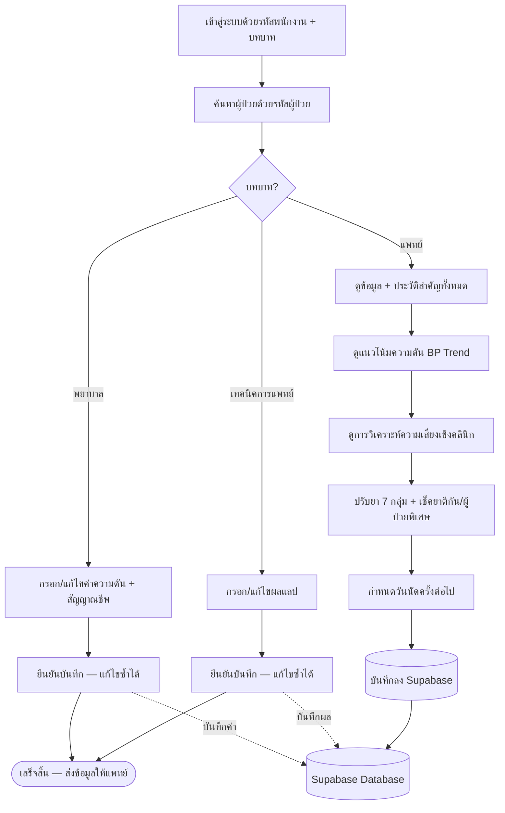

# HyperSense — แนวทางการแก้ปัญหา (สรุปสำหรับกรรมการ)

> ระบบช่วยตัดสินใจทางคลินิกสำหรับผู้ป่วย **ความดันโลหิตสูง**
> ช่วยให้ทีมแพทย์ พยาบาล และเทคนิคการแพทย์ ทำงานร่วมกันบนข้อมูลผู้ป่วยชุดเดียว

---

## 1. ระบบนี้คืออะไร — อธิบายแบบเข้าใจง่าย

ลองนึกภาพคลินิกความดันที่ผู้ป่วยมาตามนัดทุกเดือน แต่ละครั้งต้องวัดความดัน เจาะเลือด
และให้แพทย์ตัดสินใจว่าจะ "คงยาเดิม / เพิ่มยา / ลดยา" และนัดครั้งต่อไปเมื่อไร

**ปัญหาเดิม:** ข้อมูลกระจัดกระจาย แพทย์มักเห็นแค่ "ตัวเลขความดันวันนี้"
ทำให้มองภาพรวมความเสี่ยงของผู้ป่วยได้ยาก และเสี่ยงสั่งยาที่ตีกัน

**HyperSense ทำอะไร:**
ระบบรวบรวมข้อมูลผู้ป่วยไว้ที่เดียว แล้ว
1. ให้ **พยาบาล** กรอกค่าความดัน และ **เทคนิคการแพทย์** กรอกผลแลป (ตามหน้าที่ของตน)
2. คำนวณ **ระดับความเสี่ยงโรคหัวใจและหลอดเลือด** จากประวัติย้อนหลัง (ไม่ใช่แค่ค่าวันนี้)
3. สรุป **ประวัติและข้อมูลสำคัญ** (เบาหวาน ไต ASCVD สูบบุหรี่ ดื่มเหล้า ตั้งครรภ์ ผ่าตัด ฯลฯ) ให้แพทย์เห็นครบ
4. แนะนำ **กลุ่มยาความดัน 7 กลุ่ม** พร้อมเตือน "ยาที่ห้ามใช้ร่วมกัน" และ "ยาที่ควรเลี่ยงในผู้ป่วยพิเศษ" (เช่น ตั้งครรภ์)
5. ให้แพทย์ปรับยา + กำหนดวันนัด แล้วบันทึกกลับเข้าฐานข้อมูล

> **สำคัญ:** ระบบเป็นเพียง *ผู้ช่วยตัดสินใจ* — การตัดสินใจขั้นสุดท้ายเป็นของแพทย์เสมอ

---

## 2. ใครใช้ และใช้ทำอะไร (แยกตามบทบาท)

| บทบาท | ทำอะไรในระบบ | จบงานเมื่อ |
|---|---|---|
| **พยาบาล** | ค้นหาผู้ป่วย → กรอก/แก้ไขค่าความดัน (และสัญญาณชีพ) | บันทึกค่าความดันเสร็จ |
| **เทคนิคการแพทย์** | ค้นหาผู้ป่วย → กรอก/แก้ไขผลตรวจแลป | บันทึกผลแลปเสร็จ |
| **แพทย์** | เห็นข้อมูล/ประวัติทั้งหมด → ดูแนวโน้มความดัน → ดูการวิเคราะห์ความเสี่ยง → ปรับยา + นัดหมาย → บันทึก | บันทึกการรักษาเสร็จ |

พยาบาลและเทคนิคการแพทย์ทำเฉพาะส่วนของตนแล้วจบ — ข้อมูลที่กรอกจะถูกส่งต่อให้แพทย์ใช้ประกอบการตัดสินใจ

---

## 3. แผนภาพการทำงาน (Workflow)



### แบบข้อความ (เผื่อ Mermaid ไม่แสดง)

```
เข้าสู่ระบบ → ค้นหาผู้ป่วย → แยกตามบทบาท
  • พยาบาล:        กรอก/แก้ค่าความดัน → ยืนยัน → จบ
  • เทคนิคการแพทย์: กรอก/แก้ผลแลป   → ยืนยัน → จบ
  • แพทย์:         ข้อมูล+ประวัติ → BP Trend → วิเคราะห์ความเสี่ยง
                   → ปรับยา (เช็คยาตีกัน/ผู้ป่วยพิเศษ) → นัดหมาย → บันทึก
ทุกบทบาทอ่าน/เขียนข้อมูลชุดเดียวกันบน Supabase
```

---

## 4. ถ้าต่อกับโรงพยาบาลจริง — เทคโนโลยี / อัลกอริทึม / โมเดล / การ Deploy

### 4.1 เทคโนโลยีหลัก (Core Stack)

| ส่วน | เทคโนโลยี | หน้าที่ |
|---|---|---|
| Frontend | **Next.js 16 + React 19 + TypeScript** | เว็บแอปสำหรับบุคลากร (responsive) |
| ฐานข้อมูล/Auth | **Supabase (PostgreSQL + Row Level Security + Auth)** | เก็บข้อมูลผู้ป่วย + ควบคุมสิทธิ์ตามบทบาท |
| ML Service | **Python + FastAPI** | ให้บริการทำนายความเสี่ยงผ่าน REST API (`POST /predict`) |
| โมเดล | **XGBoost (multi-label)** + **SHAP** | ทำนายความเสี่ยงแต่ละโรค + อธิบายเหตุผล |

### 4.2 อัลกอริทึม / โมเดล

1. **Feature Engineering จากข้อมูลย้อนหลัง (EMR time-series)**
   - ดึงค่าจากหลายช่วงเวลา (`vitalsign_*_P`, `lab_*_P`) มาสร้างฟีเจอร์: ค่าเฉลี่ย, ความผันผวน (variability), แนวโน้ม (slope), ภาระความดันสะสม (cumulative SBP load)
2. **XGBoost multi-label classifier** — ทำนายความเสี่ยงแยกตามโรคปลายทาง:
   หัวใจล้มเหลว (HF), หลอดเลือดสมอง (Stroke), หลอดเลือดหัวใจ (CAD), ไตเรื้อรัง (CKD), หัวใจห้องบนสั่นพลิ้ว (AF)
   - จัดการข้อมูลไม่สมดุลด้วย **SMOTE**, ปรับความน่าจะเป็นด้วย **Platt scaling/Calibration**, หา **optimal threshold** ด้วย F1
   - ตรวจสอบด้วย **5-fold Stratified Cross-Validation** (AUROC/AUPRC)
3. **Explainability ด้วย SHAP** — บอกว่าฟีเจอร์ใดผลักความเสี่ยงขึ้น/ลง (ความโปร่งใสที่แพทย์ตรวจสอบได้)
4. **Rule-based Clinical Scoring (fallback ที่โปร่งใส)** — เมื่อยังไม่มีโมเดลที่เทรนแล้ว ระบบใช้เกณฑ์ทางคลินิกที่อธิบายได้ทันที จึงใช้งานได้เสมอ
5. **Medication Engine** — กฎตรวจสอบยาที่ห้ามใช้ร่วม (เช่น ACEI+ARB), ยาที่เสริมฤทธิ์กัน, และข้อห้ามในผู้ป่วยพิเศษ (ตั้งครรภ์/ผ่าตัด/เกาต์ ฯลฯ)

### 4.3 แพลตฟอร์มและการ Deploy

| ส่วน | Deploy ที่ไหน | หมายเหตุ |
|---|---|---|
| Frontend (Next.js) | **Cloudflare Pages / Vercel** | โปรเจกต์เตรียม `@opennextjs/cloudflare` + `wrangler` ไว้แล้ว |
| ML Service (FastAPI) | **Container บน Render / Google Cloud Run** | มี `Dockerfile` + `render.yaml` พร้อม autoscale |
| Database/Auth | **Supabase (managed Postgres)** | RLS แยกสิทธิ์ตามบทบาท + Audit log |
| การเชื่อม รพ.จริง | **HL7 / FHIR integration กับ HIS/EMR** | ดึง lab/vital อัตโนมัติ แทนการกรอกมือ |
| ความปลอดภัย/กฎหมาย | **PDPA, เข้ารหัสข้อมูล, RLS, Audit trail** | รองรับ on-premise/private cloud สำหรับโรงพยาบาล |

**สรุปการไหลของระบบจริง:**
```
HIS/EMR ของโรงพยาบาล  --(HL7/FHIR)-->  Supabase (Postgres + RLS)
                                              │
                Next.js (เว็บบุคลากร) <───────┤
                                              │
                FastAPI + XGBoost (ML) <──────┘  ── ทำนายความเสี่ยง + SHAP
```

---

## 5. จุดเด่นที่ตอบโจทย์

- **เห็นภาพรวม ไม่ใช่แค่ค่าความดันวันนี้** — แพทย์เห็นประวัติ โรคร่วม ASCVD ไลฟ์สไตล์ และความเสี่ยงในหน้าเดียว
- **ความปลอดภัยเรื่องยา** — เตือนยาตีกัน, ยาซ้ำกลุ่ม, และข้อห้ามในผู้ป่วยพิเศษ (โดยเฉพาะหญิงตั้งครรภ์)
- **แบ่งหน้าที่ชัดเจน** — แต่ละบทบาททำเฉพาะส่วนของตน ลดความสับสนและความผิดพลาด
- **โปร่งใสและตรวจสอบได้** — ทุกคำแนะนำมีเหตุผลกำกับ (rule-based หรือ SHAP) ไม่ใช่กล่องดำ
- **ต่อยอดสู่ระบบจริงได้** — สถาปัตยกรรมแยกส่วน (เว็บ / ฐานข้อมูล / ML) พร้อมเชื่อม HIS จริงผ่าน FHIR
